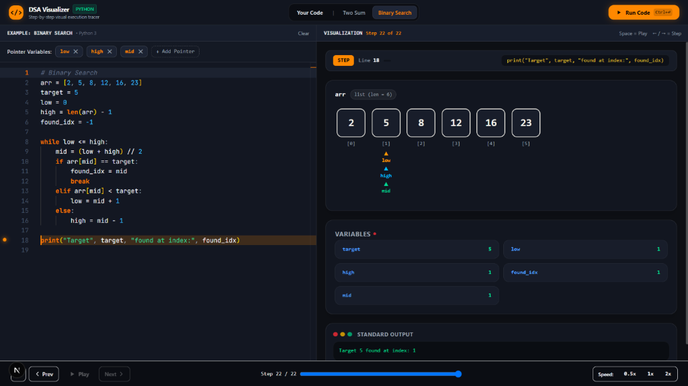

# DSA Visualizer

An interactive Python DSA visualizer that lets you execute algorithms step-by-step and visually track arrays, variables, and user-defined pointers.



DSA Visualizer executes real Python code in an isolated execution engine, captures every line-by-line state transition, and renders a live, synchronized visual interface of memory structures, variable mutations, and pointer movements.

---

## Features

- **Step-by-step Python execution**: Trace actual Python code line-by-line using `sys.settrace` with full stdout and exception monitoring.
- **Visual execution timeline**: Synchronized line-highlighting in a dark-themed Monaco code editor.
- **Array visualization**: Render lists as discrete memory cells with index indicators (`[0]`, `[1]`, `[2]`, ...).
- **Variable state tracking**: Automatic tracking of primitive scalars (`int`, `float`, `str`, `bool`), dictionaries, and sets.
- **User-defined pointer visualization**: Explicitly select pointer variable names to render dynamic pointers (`▲ low`, `▲ high`, `▲ mid`) directly beneath corresponding array cells.
- **Play / Pause / Step controls**: Navigate back and forth through recorded steps or autoplay execution.
- **Adjustable execution speed**: Control playback speed presets (`0.5x`, `1x`, `2x`).
- **Two Sum example**: Built-in demonstration of array iteration, variable tracking, and dictionary lookup.
- **Binary Search example**: Built-in demonstration of divide-and-conquer on sorted arrays with `low`, `high`, and `mid` pointers.
- **Custom Python code support**: Dedicated **Your Code** workspace to write, paste, and visualize any Python DSA algorithm.

---

## How It Works

1. **Write or load Python code**: Choose between the built-in educational examples or use the dedicated **Your Code** editor.
2. **Specify pointer variables**: Enter the exact variable names used as pointers in your code (e.g., `low`, `high`, `i`, `j`).
3. **Run the code**: Click **Run Code** (or press `Ctrl + Enter`) to execute the Python script through the backend tracer.
4. **Execution states are captured**: Line numbers, memory snapshots, local variables, standard output, and runtime events are recorded for every step.
5. **Step through execution**: Use the playback controls or keyboard shortcuts (`←` / `→` to step, `Space` to play/pause).
6. **Observe variables and pointers visually**: Watch pointer indicators navigate across array indices and watch variable values update in real time.

---

## Pointer Variables

A core feature of DSA Visualizer is **User-Defined Pointer Variables**. 

Rather than relying on inaccurate heuristics or guessing which integer variable represents an index pointer, the user explicitly controls which variables should receive pointer indicators on arrays.

For example, given this code:

```python
arr = [2, 5, 8, 12, 16, 23]
target = 5
low = 0
high = len(arr) - 1
found_idx = -1

while low <= high:
    mid = (low + high) // 2
    if arr[mid] == target:
        found_idx = mid
        break
    elif arr[mid] < target:
        low = mid + 1
    else:
        high = mid - 1
```

The user specifies:
- `low`
- `high`
- `mid`

The visualizer treats **only** `low`, `high`, and `mid` as pointer indicators underneath the array:

```text
               low    high   mid
                ▲      ▲      ▲
       [ 2 ]  [ 5 ]  [ 8 ]  [ 12 ]  [ 16 ]  [ 23 ]
        [0]    [1]    [2]    [3]     [4]     [5]
```

Other variables like `target = 5` or `found_idx = -1` remain in the **Variables** inspection panel and are **never** rendered as array pointers.

---

## Built-in Examples

The application includes two built-in examples:

1. **Two Sum**:
   Demonstrates array traversal, variable state tracking, and hash map lookup (`seen[num] = i`) with a single pointer `i`.
2. **Binary Search**:
   Demonstrates classic divide-and-conquer on a sorted array with three pointers: `low`, `high`, and `mid`.

---

## Custom Code

The **Your Code** workspace is the primary experience of the application. Users can write, paste, and run any custom Python algorithm, adjust pointer variables dynamically, and visualize custom loops, sliding windows, two-pointer algorithms, and array mutations.

---

## Tech Stack

- **Frontend**:
  - [Next.js](https://nextjs.org/) 16 (Pages router, React 19)
  - [Monaco Editor](https://microsoft.github.io/monaco-editor/) (`@monaco-editor/react`)
  - [Tailwind CSS](https://tailwindcss.com/) v4
  - [Axios](https://axios-http.com/)
- **Backend**:
  - [FastAPI](https://fastapi.tiangolo.com/)
  - [Uvicorn](https://www.uvicorn.org/)
  - [Python 3](https://www.python.org/) (`sys.settrace`, `subprocess` isolation, JSON IPC)

---

## Getting Started

### Prerequisites

- **Node.js**: Version 18+ and `npm`
- **Python**: Version 3.10+

### 1. Start the Backend Tracer

From the project root:

```bash
cd backend
pip install -r requirements.txt
python -m uvicorn app.main:app --host 127.0.0.1 --port 8000
```

The tracer service will start on `http://127.0.0.1:8000`. You can test the health endpoint at `http://127.0.0.1:8000/health`.

### 2. Start the Frontend Development Server

In a new terminal from the project root:

```bash
npm install
npm run dev
```

Open [http://localhost:3000](http://localhost:3000) in your browser.

---

## Production Build

To build the frontend for production:

```bash
npm run build
```

To run the production build locally:

```bash
npm run start
```

---

## Deployment

### Frontend Deployment (Vercel)

The Next.js frontend can be deployed directly to [Vercel](https://vercel.com/):

1. Push your repository to GitHub.
2. Import the repository in Vercel.
3. Configure the environment variable:
   ```env
   NEXT_PUBLIC_API_URL=https://your-python-backend.com
   ```
4. Deploy.

### Backend Deployment

The FastAPI backend can be deployed to any Python host (e.g., Render, Railway, Fly.io, or a VPS):

```bash
python -m uvicorn backend.app.main:app --host 0.0.0.0 --port 8000 --workers 4
```

---

## Project Structure

```text
dsa-visualizer/
├── docs/
│   └── images/
│       └── dsa-visualizer-demo.png   # Application screenshot
├── backend/
│   ├── requirements.txt              # Python dependencies (fastapi, uvicorn, pydantic)
│   └── app/
│       ├── main.py                   # FastAPI server & CORS setup
│       ├── models.py                 # Pydantic schemas for trace requests and steps
│       ├── runner.py                 # Isolated tracer script with cycle detection
│       └── tracer.py                 # Subprocess runner with timeout safety
├── src/
│   ├── components/
│   │   ├── Controls.tsx              # Play/Pause, step navigation, scrubber, speed presets
│   │   ├── Editor.tsx                # Monaco editor with active line markers
│   │   ├── PointerInput.tsx          # User-defined pointer variable input and chips
│   │   └── Visualization.tsx         # Array cards, pointers, and variables inspector
│   ├── pages/
│   │   ├── _app.tsx                  # App root
│   │   └── index.tsx                 # Main layout (Your Code vs Examples, side-by-side workspace)
│   └── styles/
│       └── globals.css               # Theme styling and custom scrollbars
├── .env.example                      # Environment variable template
├── .gitignore                        # Git ignore rules for Next.js, Node, and Python
├── package.json                      # NPM dependencies and scripts
├── tsconfig.json                     # TypeScript configuration
└── README.md                         # Project documentation
```

---

## Future Improvements

The following items are planned for future iterations:

- AST-based code understanding and semantic analysis
- Automatic variable-role detection and smart suggestions
- More data structure visualizations (Trees, Linked Lists, Graphs)
- Additional curated algorithm examples
- AI-assisted execution explanations
- Advanced call stack and recursion tree visualization
